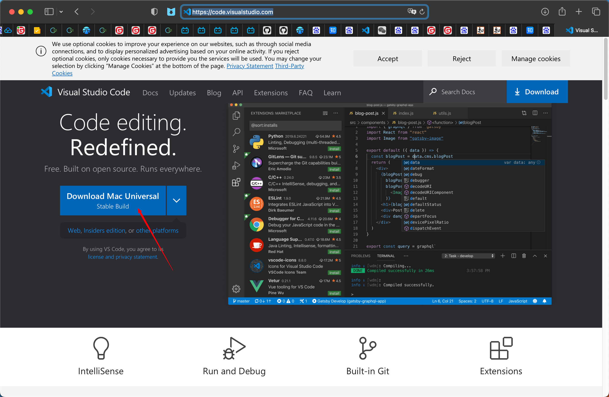
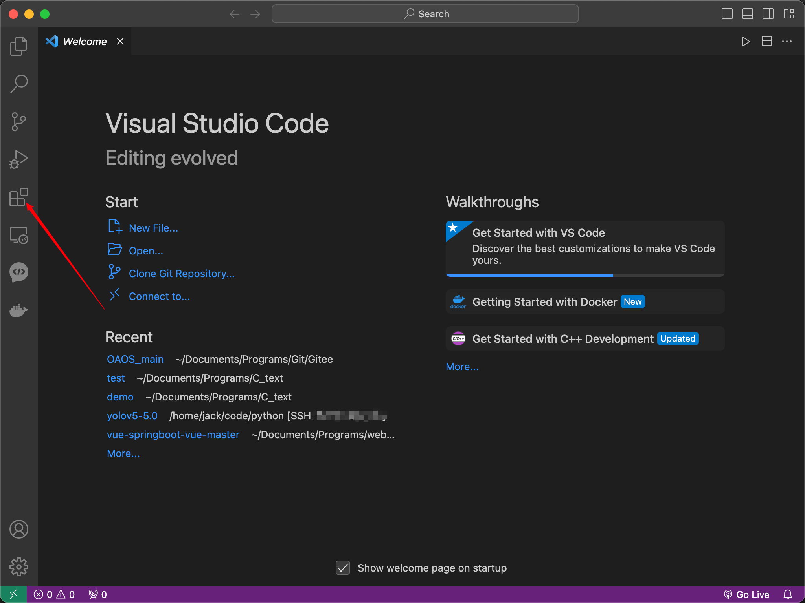
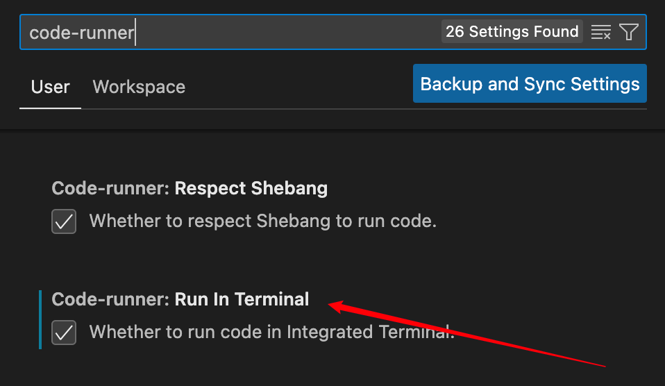
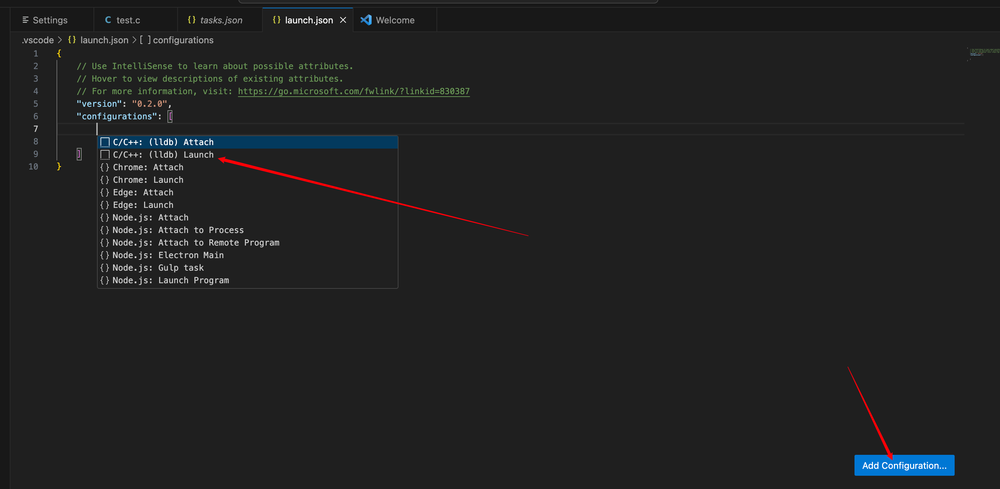
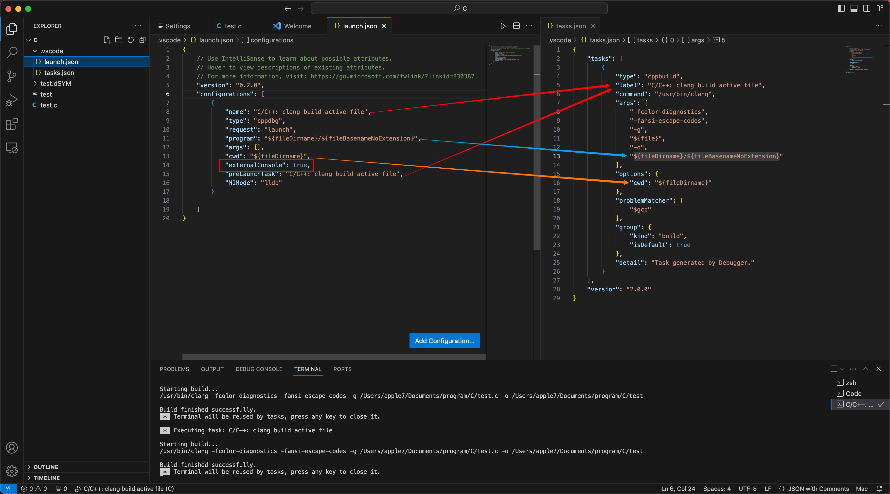

# 配置Viusal Studio Code C/C++开发环境

## Mac

### 下载Xcode
Xcode包含了C++开发的大部分工具，编译器，GDB调试工具等
直接在app store就可以搜索到


下载完成之后 需要在终端里输入一行命令安装命令行工具
```
xcode-select --install
```

### 下载[VS code](https://code.visualstudio.com)


打开VS code 点击插件



下载``code runner``


按照下面操作打开设置面板


搜索code runner 往下翻看 找到RUN IN TERMINAL 一定要选择上



任何选择一个文件夹 新建一个代码文件 写入简单的程序
```c
#include <stdio.h>
int main()
{
    printf("hello world\n");
    return 0;
}
```
点击右上角的run code 就可以运行程序了 如图 运行的信息都会在下面的terminal里


### 配置调试环境

首先需要下载一个插件


在任意代码文件下点击调试右上角的debug按钮 


点击debug界面 设置launch.json文件




将Launch.json文件修改如下



调试成功


### 配置文件参考
* `task.json`
```json
{
    "tasks": [
        {
            "type": "cppbuild",
            "label": "C/C++: clang build active file",
            "command": "/usr/bin/clang",
            "args": [
                "-fcolor-diagnostics",
                "-fansi-escape-codes",
                "-g",
                "${file}",
                "-o",
                "${fileDirname}/${fileBasenameNoExtension}"
            ],
            "options": {
                "cwd": "${fileDirname}"
            },
            "problemMatcher": [
                "$gcc"
            ],
            "group": {
                "kind": "build",
                "isDefault": true
            },
            "detail": "Task generated by Debugger."
        }
    ],
    "version": "2.0.0"
}
```
* `Launch.json`
```json
{
    // Use IntelliSense to learn about possible attributes.
    // Hover to view descriptions of existing attributes.
    // For more information, visit: https://go.microsoft.com/fwlink/?linkid=830387
    "version": "0.2.0",
    "configurations": [
        {
            "name": "C/C++: clang build active file",
            "type": "cppdbg",
            "request": "launch",
            "program": "${fileDirname}/${fileBasenameNoExtension}",
            "args": [],
            "stopAtEntry": false,
            "cwd": "${fileDirname}",
            "environment": [],
            "externalConsole": true,
            "preLaunchTask": "C/C++: clang build active file",
            "MIMode": "lldb"
        }
    ]
}
```